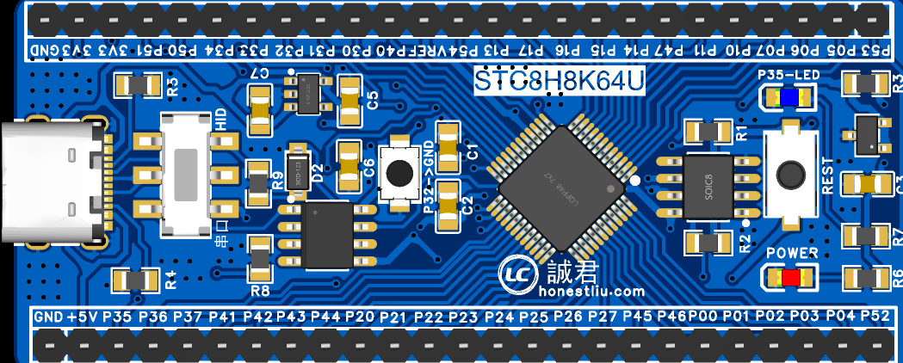
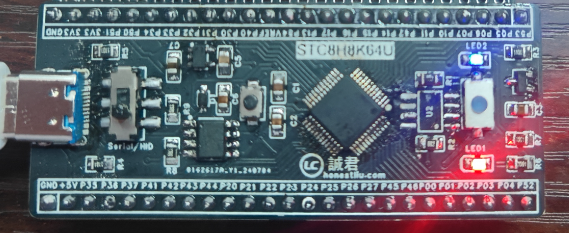
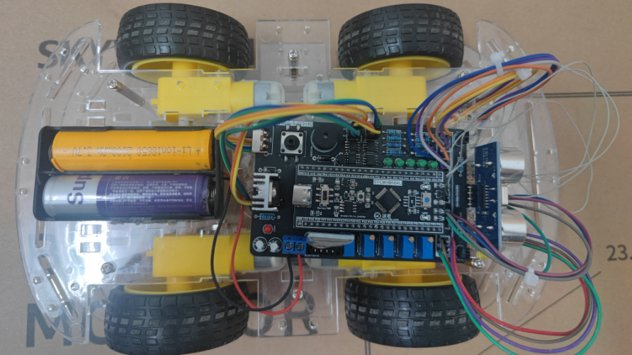

## 仓库说明
> [!WARNING]
> 仓库中的PCF8563的代码不要使用，是存在问题的，当时没改出来，以后有机会我再改吧，要使用可以参考ARM仓库的驱动，那个已经调通了

**芯片:** STC8H8K64U

**学习课程:** [黑马公开的集成电路(含嵌入式)文档](https://www.yuque.com/icheima)

**使用板卡:** 自己画的STC8H8K64U开发板(参考了黑马的开发板,,ԾㅂԾ,,)，外置EPROM无法使用

- 图纸见仓库Document内，使用嘉立创EDA专业版打开即可

- 渲染图

- 成品:EPROM发热严重，我没装

  

**关于小车:** 也在仓库Document内，一个是黑马原版的，一个是我自己画的，支持上面板卡的驱动板，按需使用

**我的小车:** 完成黑马的课大致可以，不过不知道是我板子绘制问题还是焊接问题，巡线只有左边两个能用😂，其它都是正常的

## 代码说明

>[!TIP]
>
> 本仓库所谓的Dayx,不是实际的天数，这是根据课程而定的

暂无
